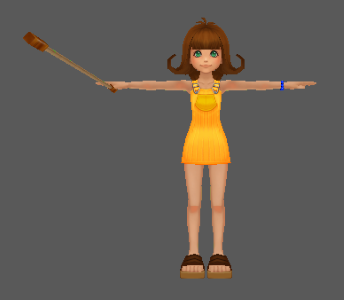

###### [Kingdom Hearts II](../index.md) / Game Files /

# Unused Content

There are a number of files that go unused in normal gameplay. Details on such files can be found here.

* [Graphics](#graphics)
* [Abilities](#abilities)
* [Weapons](#weapons)
* [Models](#models)

 

## Graphics

| Filename       | Image | Notes |
|----------------|:-----:|-------|
| lm0command.2dd |  | Atlantica menu variant
|                |  | Sora's Hud icons for Atlantica (middle and right are unused)
| p_lm100.bin    |  | Sora's Atlantica shop icon
| p_lm020.bin    |  | Donald's Atlantica shop icon
| p_lm30.bin     |  | Goofy's Atlantica shop icon
|                |  | Peter Pan's shop icon (Peter Pan intended as party member?)
| trampoline.tm2 |  | Trampoline icon
|                |  | Placeholder texture in HD remasters
|                |  | PS2 release item placeholder icon (later replaced with items in Final Mix)
|                |  | Early icon for Megalixir
|                |  | An icon for what is most likely meant to be a Hi-Ether
|                |  | Debug item icon (HD remaster)

 

## Abilities

| Ability | HEX Id | Image | Notes |
|---------|--------|:-----:|-------|
| Slow 3  | 00C3   |  | An unused ability meant for Tron; contains the following description: "(Delete)"
| Slow 2  | 01BD   |  | An unused ability meant for Tron; contains the following description: "(Delete)"

 

## Weapons

| Name             | Type     | HEX Id | Image | Notes |
|------------------|----------|--------|:-----:|-------|
| FAKE             | Keyblade | 0051   | | Has the same model as the Kingdom Key; has no texture in PS2 releases
| Detection Saber  | Keyblade | 002C   |  | Uses the same model as the Ultima Weapon from KH1, using a placeholder texture; slightly bigger than the Edge of Ultima
| Edge of Ultima   | Keyblade | 002D   |  | Uses the same model as the Ultima Weapon from KH1, using a placeholder texture
| Detection Staff  | Staff    | 001A   |  |
| Detection Shield | Shield   | 0032   |  |
| Detect the King  | Shield   | 0033   |  |

 

## Models

| Filename      | Image | Notes |
|---------------|:-----:|-------|
| H_ZZ010       |                       | Sora's high-poly KH1 model; contains player animations from KH1
| H_CM060       |                       | Riku with Organization XIII outfit
| H_CM070       |                       | KH1 Riku with wooden sword
| H_CM080       |                       | Kairi's KH1 model
| H_ZZ040       |                       | KH1 Donald with traditional outfit
| H_ZZ050       |                       | KH1 Goofy with traditional outfit
| N_CM060_TSURU |                 | Squall from KH1
| N_CM070_TSURU |                 | Yuffie from KH1
| N_CM080_TSURU |                 | Aerith from KH1
| N_CM090_TSURU |                 | Cid from KH1
| N_CM100_TSURU |                 | Tidus from KH1
| N_CM110_TSURU |                       | Selphie from KH1
| N_CM120_TSURU |                 | Wakka from KH1
| N_ZZ160_EV    |  | Ansem with Guardian from KH1
